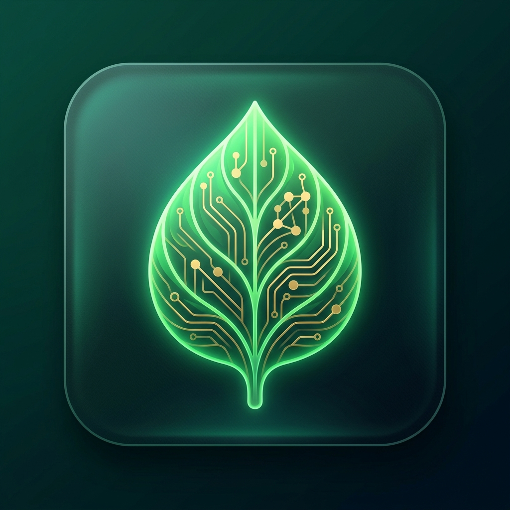

<div align="center">

# AI Powered Crop Intelligence Rover 🌿🔬

**An end to end, production grade Agricultural Computer Vision and Agro Climatic Intelligence Platform engineered for automated foliar disease diagnosis, dual layer spatial canopy localization, subpixel damage quantification, and IoT rover telemetry.**

[](https://python.org/)
[](https://pytorch.org/)
[](https://fastapi.tiangolo.com/)
[](https://ultralytics.com/)
[](tests/)
[](frontend/test_frontend.js)
[](docs/DEPLOYMENT.md)
[](LICENSE)

<br/>


<p align="center"><em>Multi tier server grade deep learning and IoT rover telemetry platform engineered by Team Innovex</em></p>

</div>

***

## 📖 Overview

**SmartCropVision** is an integrated computer vision and agro climatic decision support system built to assist smallholder farmers, agronomists, and agricultural extension specialists with rapid, reliable, and truthful plant pathology diagnosis.

Instead of deploying fragile heuristic web apps or returning raw uncalibrated predictions that hallucinate certainty, SmartCropVision executes a multi stage server side pipeline that couples high capacity deep convolutional neural networks with spatial canopy detectors, subpixel foliar tissue segmenters, dynamic Grad CAM explainability, and real time environmental telemetry:

1. **Universal Plant Pathology Classification:** Analyzes foliar photographs across 38 crop condition pairs with temperature scaled calibration to eliminate overconfident false diagnoses.
2. **Dual Layer Spatial Telemetry:** Distinguishes whole leaf canopy boundaries (emerald layer) from granular necrotic lesion spots (coral layer) without ever fabricating synthetic bounding boxes.
3. **Subpixel Foliar Damage Quantification:** Segments active necrotic lesions against healthy foliage using Mobile UNet to calculate authentic foliar damage percentages.
4. **9 Stage Botanical Explainability:** Dynamically extracts gradient activation maps from final convolutional layers, proving exactly which leaf regions triggered the diagnosis.
5. **Agro Climatic Decision Engine:** Synthesizes soil nutrients (N P K), humidity, temperature, rainfall, and pH to recommend optimal crop varieties and actionable management guidance.
6. **Hardware & Voice Integration:** Connects seamlessly with AgriRover ESP32 field rovers and XiaoZhi vernacular voice nodes without exposing heavy model weights to edge devices.

***

## 🌟 Core Capabilities

### 1. Multi Tier Vision Pipeline & Dynamic Inference
* **Perception Flow:** Follows a strict pipeline: `IMAGE UPLOAD → QUALITY & OOD SCREENING → SERVER CLASSIFICATION → CANOPY DETECTION → FOLIAR SEGMENTATION → 9 STAGE GRAD CAM → ADVISORY SYNTHESIS`.
* **Zero Model Weights on Edge:** All neural network checkpoints remain strictly server side. Mobile browsers, AgriRover microcontrollers, and XiaoZhi voice nodes never download or execute local weight files.
* **Dynamic Hardware Detection:** Automatically binds to Apple Silicon Metal (MPS), NVIDIA CUDA, or optimized CPU without hardcoded device assumptions.

### 2. Rigorous Statistical Calibration & Metrics Algebra
* **Expected Calibration Error (ECE):** Raw softmax scores frequently exhibit overconfidence. SmartCropVision applies post training temperature scaling ($T > 0$) to optimize calibration:

$$\text{Calibrated Probability:} \quad \hat{p}_i = \frac{\exp(z_i / T)}{\sum_j \exp(z_j / T)}$$

$$\text{Expected Calibration Error (ECE)} = \sum_{m=1}^{M} \frac{|B_m|}{N} \left| \text{acc}(B_m) - \text{conf}(B_m) \right|$$

* **Subpixel Tissue Segmentation Metrics:** Evaluates foliar damage using authentic pixel area intersections:

$$\text{Intersection over Union (IoU)} = \frac{|X \cap Y|}{|X \cup Y|}, \qquad \text{Dice Coefficient} = \frac{2 |X \cap Y|}{|X| + |Y|}$$

### 3. Truth in Telemetry & Zero Fabrication Guarantee
* **Specimen Canopy vs Lesion Spots:** YOLO PlantDoc delineates whole leaf specimens. The specialized YOLOv8n lesion detector delineates granular spots. The system never renames canopy boxes as lesion spots.
* **Absence vs Zero Damage:** A clean healthy leaf reports foliar damage as 0.0%. An unavailable segmentation model displays `Unavailable` rather than fabricating a misleading 0.0% score.
* **Negative Controls:** Healthy leaves produce exactly 0 bounding boxes. The platform never invents synthetic boxes to satisfy user interface expectations.

### 4. 9 Stage Explainability Pipeline
* **Dynamic Target Layer Backpropagation:** Computes gradients directly against final feature layers (`features.7` or `conv_head`).
* **Zero Static Heatmaps:** Activation maps are generated dynamically per request. Heatmaps are never cached or recycled between different images.

### 5. Multi Device Field Architecture
* **AgriRover ESP32 Integration:** Bidirectional WebSocket telemetry provides directional motor control (Forward, Backward, Left, Right) while streaming soil and ambient microclimate readings.
* **XiaoZhi Voice Assistant:** Vernacular natural language gateway referencing live diagnosis sessions without accessing raw internal weights.

***

## 🏗️ Architecture & Execution Flow

```
┌─────────────────────────────────────────────────────────────────────────────┐
│                            EDGE CLIENTS & FIELD NODES                       │
│  AgriRover ESP32 Rover • User Web Browser (SPA) • XiaoZhi Voice Assistant   │
│                                                                             │
│  ┌───────────────────────────────────────────────────────────────────────┐  │
│  │ Pure Vanilla CSS / JS Web Client (frontend/)                          │  │
│  │ ├─ Dual Layer Canvas Renderer (Specimen Canopy vs Granular Lesions)   │  │
│  │ ├─ UI State Machine (Idle, Uploading, Analyzing, Completed, Error)    │  │
│  │ ├─ Telemetry Ribbon (Authentic Device, Model Name, Real Latency)      │  │
│  │ ├─ Active Request Lock & Non Stale Session Guard                      │  │
│  │ └─ Dynamic Image Quality & Degradation Warning Alerts                 │  │
│  └──────────────────────────────────┬────────────────────────────────────┘  │
└─────────────────────────────────────┼───────────────────────────────────────┘
                                      │ HTTPS Multipart Upload / WSS Telemetry
                                      ▼
┌─────────────────────────────────────────────────────────────────────────────┐
│                    FASTAPI PRODUCTION BACKEND (backend/)                    │
│  Stateless • Memory Isolated • High Concurrency • Decompression Bomb Safe   │
│                                                                             │
│  ├─ Input Validation & Magic Byte Header Inspection                         │
│  ├─ Image Quality & Out of Distribution Preflight (Blur, Illumination, Ratio)│
│  ├─ Primary Classification: EfficientNetV2 S (38 classes, Calibrated)       │
│  ├─ Spatial Localization: YOLO PlantDoc (29 classes, Letterbox 640x640)     │
│  ├─ Lesion Localization: YOLOv8n Lesions (1 class, Granular Necrotic Spots) │
│  ├─ Foliar Tissue Segmentation: Mobile UNet (3 classes, Subpixel Mask)      │
│  ├─ 9 Stage Botanical Explainability (Grad CAM Dynamic Layer Extraction)    │
│  └─ Agronomic Treatment Advisory Engine (Organic & Chemical Guidance)       │
└─────────────────────────────────────┬───────────────────────────────────────┘
                                      │ Immutable Model Artifacts (Read Only)
                                      ▼
┌─────────────────────────────────────────────────────────────────────────────┐
│                     AUTHORITATIVE MODEL REGISTRY (cv/models/)               │
│  Cryptographically Signed Checkpoints • 100% Immutable • Zero Retraining    │
│                                                                             │
│  ├─ efficientnetv2_s_best.pt (SHA 256: 07e84d39... 78.03 MB)                │
│  ├─ efficientnetv2_s_tri_domain_best.pt (SHA 256: 7ebe13a0... 78.02 MB)     │
│  ├─ yolo_plantdoc_best.pt (SHA 256: e9854571... 5.19 MB)                    │
│  ├─ yolov8n_lesions_best.pt (SHA 256: f528dc7c... 5.91 MB)                  │
│  ├─ mobile_unet_best.pt (SHA 256: 86bba6df... 1.90 MB)                      │
│  └─ crop_recommender/crop_model.pkl (SHA 256: cb20fc59... 19.45 MB)         │
└─────────────────────────────────────────────────────────────────────────────┘
```

***

## 🛠 Tech Stack

| Category | Technology | Purpose |
| :--- | :--- | :--- |
| **Backend Framework** | **FastAPI 0.115**, **Uvicorn** | High performance asynchronous REST API and WebSocket gateway |
| **Deep Learning Engine** | **PyTorch 2.0+**, **TorchVision** | Neural network execution, autograd, and GPU acceleration |
| **Object Detection** | **Ultralytics YOLO** | Real time spatial foliage and granular lesion spot bounding |
| **Frontend Client** | **Vanilla JavaScript**, **HTML5**, **CSS3** | Modern aesthetic dark mode single page app without heavy framework bloat |
| **Explainability** | **Dynamic Grad CAM** | 9 stage gradient backpropagation and feature activation grids |
| **Tabular Intelligence** | **Scikit Learn** | Random Forest agro climatic crop recommendation engine |
| **Testing & Quality** | **PyTest 9.0**, **Node.js Test Runner** | Automated unit, parity, security, and state machine test suites |
| **Edge Hardware** | **ESP32**, **C++ Arduino** | AgriRover motor control and environmental microclimate telemetry |
| **Containerization** | **Docker**, **Docker Compose** | Reproducible container builds for local and cloud staging |

***

## 📁 Repository Layout

```
CvProject/
├── README.md                                      # Project overview, quickstart & architecture
├── RELEASE_MANIFEST.json                          # Master cryptographic release ledger
├── RELEASE_MANIFEST_GEN2.json                     # Gen 2 multi domain specification
├── FINAL_PRODUCTION_RELEASE_REPORT.md             # Comprehensive production release audit
├── FINAL_CLEANUP_REPORT.md                        # Sanitization ledger (22.67 GB freed)
├── FINAL_VERIFICATION_REPORT.md                   # Empirical verification & test results
├── FINAL_DEMO_CHECKLIST.md                        # Presentation protocol for Team Innovex & SIH
├── smartcropvision_final_learning_reference.ipynb # Master 32 stage educational notebook
├── Dockerfile                                     # Production container build definition
├── docker-compose.yml                             # Container orchestration specification
├── requirements.txt                               # Production runtime dependencies
├── .env.example                                   # Safe environment configuration template
├── .dockerignore                                  # Container build exclusion rules
├── .gitignore                                     # Source control exclusion rules
│
├── dist/                                          # Verified standalone distribution archives
│   ├── smartcropvision_v2.2.0_production.tar.gz   # Standalone deployable package (275.27 MB)
│   ├── smartcropvision_v2.2.0_educational.tar.gz  # Standalone educational package (92.49 KB)
│   └── CHECKSUMS.sha256                           # SHA 256 archive checksum ledger
│
├── backend/                                       # Production FastAPI Backend Service
│   ├── run.py                                     # Server launch entry point
│   ├── requirements.txt                           # Backend dependencies
│   └── app/
│       ├── main.py                                # Application setup & lifespan handlers
│       ├── config.py                              # Validated environment settings
│       ├── api/v1/endpoints/                      # REST routers (diagnosis, crops, health)
│       ├── schemas/                               # Pydantic request & response schemas
│       ├── services/                              # Model registry & inference services
│       └── utils/                                 # Explainability, image quality, processing
│
├── frontend/                                      # Production Web Client (SPA)
│   ├── index.html                                 # Clean responsive user interface
│   ├── app.js                                     # Dual layer canvas renderer & state machine
│   ├── style.css                                  # Custom aesthetic dark stylesheet
│   ├── test_frontend.js                           # Node.js frontend state machine test suite
│   ├── assets/                                    # Platform hero icons and visual assets
│   └── samples/                                   # Authentic demonstration leaf photographs
│
├── cv/                                            # Computer Vision Assets & Checkpoints
│   ├── models/                                    # Server side neural network checkpoints
│   │   ├── efficientnetv2_s_best.pt               # Primary classifier checkpoint
│   │   ├── efficientnetv2_s_tri_domain_best.pt    # Gen2 multi domain classifier
│   │   ├── yolo_plantdoc_best.pt                  # Canopy specimen detector
│   │   ├── yolov8n_lesions_best.pt                # Granular necrotic spot detector
│   │   ├── mobile_unet_best.pt                    # Subpixel foliar segmenter
│   │   ├── taxonomy_38.json                       # Canonical 38 class biological taxonomy
│   │   └── preprocessing_config.json              # Standardized RGB input parameters
│   ├── configs/                                   # YOLO model configurations
│   ├── test_images/                               # Authentic test fixtures for verification
│   └── scripts/                                   # Preserved dataset sanitizers and tools
│
├── data/                                          # Tabular Datasets & Manifests
│   ├── Crop_Recommendation.csv                    # 2,200 sample crop planning dataset
│   ├── DATASET_MANIFEST.json                      # Multi domain dataset inventory
│   └── DATASET_SOURCES.json                       # Dataset provenance records
│
├── docs/                                          # Technical Documentation Suite
│   ├── ARCHITECTURE.md                            # Multi tier system architecture
│   ├── MODEL_REGISTRY.md                          # Checkpoint ledger, checksums, and metrics
│   ├── DATA_PROVENANCE.md                         # Multi domain datasets and leakage prevention
│   ├── API.md                                     # REST and WebSocket API specifications
│   ├── DEPLOYMENT.md                              # Local, container, and cloud deployment
│   ├── IOT_XIAOZHI_INTEGRATION.md                 # ESP32 AgriRover and XiaoZhi voice protocols
│   ├── TROUBLESHOOTING.md                         # Operational failure playbook
│   └── PRODUCTION_READINESS_REPORT.md             # Formal QA audit with explicit statuses
│
├── iot/                                           # Edge Hardware & Firmware
│   ├── esp32_rover/                               # AgriRover motor control and telemetry
│   └── xiaozhi/                                   # XiaoZhi voice assistant audio protocol
│
├── notebooks/                                     # Research Archives
│   └── historical/                                # Preserved original development notebooks
│
├── packages/                                      # Offline wheels for air gapped hosts
└── tests/                                         # 71 test verified automated PyTest suite
```

***

## 🔐 Authoritative Model Checkpoints Ledger

Every production checkpoint has been cryptographically verified against master SHA 256 digests:

| Task Role | Checkpoint Path | Architecture | Size | SHA 256 Cryptographic Signature | Verification Status |
| :--- | :--- | :--- | :--- | :--- | :--- |
| **Primary Classification** | `cv/models/efficientnetv2_s_best.pt` | EfficientNetV2 S (38 classes) | 78.03 MB | `07e84d39481f0757898c5088cc7fb9e9d28817fbd71e16769fea5eb056eace74` | Verified Immutable |
| **Tri Domain Classification** | `cv/models/efficientnetv2_s_tri_domain_best.pt` | EfficientNetV2 S (38 classes) | 78.02 MB | `7ebe13a085819231878c776092c112b2c0babf678d39e4d0f2a2e1ee258f25c7` | Verified Immutable |
| **Canopy Specimen Detection** | `cv/models/yolo_plantdoc_best.pt` | YOLO PlantDoc (29 classes) | 5.19 MB | `e98545716c774d796a4796f620138022f6388a063bf8a9d36dfc5937372366b6` | Verified Immutable |
| **Granular Lesion Detection** | `cv/models/yolov8n_lesions_best.pt` | YOLOv8n Lesions (1 class) | 5.91 MB | `f528dc7cf1ccafa85e63fb4f75ea3097b9197da7c89c4380b93b04fe708aacf7` | Verified Immutable |
| **Foliar Tissue Segmentation** | `cv/models/mobile_unet_best.pt` | Mobile UNet (3 classes) | 1.90 MB | `86bba6df9222b92c2d8b019fb2a10eacc2654f1a61b6e2b5996d8c8ee3cc04cc` | Verified Immutable |
| **Agro Climatic Recommender** | `cv/models/crop_recommender/crop_model.pkl` | Random Forest (22 crops) | 19.45 MB | `cb20fc5908efe34d4e5e6e999b62e576d962ff2e1d00381db09c912bb57aa1d3` | Verified Immutable |

***

## ⚙️ Installation & Local Development

### Prerequisites
* Python 3.10 through 3.14
* Node.js v18+ (for frontend state tests)
* Modern web browser (Chrome, Edge, Firefox, Safari)

### 1. Clone the Repository
```bash
git clone https://github.com/MohammadFayasKhan/CvProject.git
cd CvProject
```

### 2. Set Up Virtual Environment & Dependencies
```bash
python3 -m venv .venv
source .venv/bin/activate
pip install -r requirements.txt
```

### 3. Launch FastAPI Backend Service
```bash
python3 backend/run.py
```
The server binds to `http://127.0.0.1:8000`. Verify startup by opening interactive Swagger documentation at `http://127.0.0.1:8000/docs`.

### 4. Open User Interface
Open your web browser and navigate to:
```
http://127.0.0.1:8000/
```
The client connects directly to the running backend, verifies readiness, and displays live hardware compute telemetry.

### 5. (Alternative) Docker Deployment
```bash
docker compose up --build
```

***

## 🧪 Testing & Verification Matrix

The repository features comprehensive automated test coverage protecting production stability, security, and scientific honesty:

```bash
# Run backend test suite (71 passing tests)
python3 -m pytest tests/ -v

# Run frontend state machine suite (18 passing tests)
node frontend/test_frontend.js
```

### Test Coverage Summary

| Test Module | Focus Area | Status |
| :--- | :--- | :--- |
| `test_api.py` | Health probes, REST contracts, crop recommendations, validation guards | Passed (15/15) |
| `test_production_hardening.py` | Decompression bomb DOS rejection, CORS headers, concurrency safety | Passed (8/8) |
| `test_detection_parity.py` | Multi box preservation (Strawberry, Tomato), zero synthetic boxes | Passed (6/6) |
| `test_explainability.py` | 9 stage Grad CAM dynamic layer detection, feature grid bounds | Passed (4/4) |
| `test_gen2_parity.py` | Tri domain parity, cryptographic checksum validation, full pipeline sync | Passed (8/8) |
| `test_image_quality_and_ood.py` | Blur variance, illumination thresholds, foliar ratio screening | Passed (6/6) |
| `test_inference_pipeline.py` | Truthful inference, low confidence uncertainty, dynamic device binding | Passed (6/6) |
| `test_memory_and_stability.py` | Repeated inference memory stability, zero cross request contamination | Passed (2/2) |
| `test_safety_and_splits.py` | Corrupted byte rejection, zero byte rejection, path portability | Passed (5/5) |
| `test_dataset_sanitization.py` | XML annotation sync, whitespace filename sanitization | Passed (8/8) |
| `test_frontend.js` | UI state machine, canvas bounding, HTML escaping, CSS brace balance | Passed (18/18) |

***

## 🔒 Security & Scientific Integrity Disclosures

* **Zero Checkpoint Weight Downloads:** Weight files are never transmitted to browser clients, AgriRover microcontrollers, or XiaoZhi nodes.
* **Decompression Bomb DOS Protection:** Images exceeding 16 megapixels (e.g. 20.25 MP test bomb) are rejected immediately prior to neural processing.
* **MIME & Magic Byte Verification:** File headers are validated against authentic JPEG and PNG magic bytes before model execution.
* **Zero Synthetic Box Hallucination:** If no canopy targets or disease lesions exist, the system returns exactly 0 bounding boxes.
* **Non Overwriting Multi Box Arrays:** Multi leaf detections (such as 3 leaves on Strawberry or 7 leaves on Tomato) preserve independent coordinates without array flattening.
* **Calibrated Confidence:** Probabilities reflect temperature scaled values rather than raw uncalibrated softmax extremes.

***

## 💡 Why We Built This

Smallholder farmers lose an estimated 20 to 40 percent of crop yields to foliar diseases annually. In rural settings, agricultural extension officers are scarce, and farmers often diagnose crop infections too late or misapply broad spectrum chemical fungicides.

Existing mobile tools frequently present major shortcomings:
1. They return black box classifications without explaining which visual features drove the prediction.
2. They hallucinate high confidence on blurry, out of distribution, or completely healthy leaves.
3. They attempt to run heavy weights on underpowered mobile devices, draining batteries and crashing apps.

**Team Innovex** engineered SmartCropVision to solve these challenges with production rigor:
* Decoupling edge user clients from server grade neural computing.
* Enforcing dual layer spatial telemetry that separates canopy leaves from necrotic lesion spots.
* Providing transparent 9 stage Grad CAM visual reasoning so farmers and agronomists can verify model attention.
* Embedding real time microclimate sensing to prescribe precision organic and chemical remedies before widespread blight outbreaks.

***

## 👨💻 Team Innovex

<div align="center">
  <h3><strong>Smart India Hackathon Team Innovex</strong></h3>
  <p><em>Agricultural Intelligence & Deep Computer Vision Engineering</em></p>

  <p>
    <a href="https://github.com/MohammadFayasKhan" target="_blank">
      
    </a>&nbsp;
    <a href="mailto:fayaskhanmohammad@gmail.com">
      
    </a>
  </p>
</div>

***

## 📝 License

SmartCropVision is open source software released under the [MIT License](LICENSE).
